# Awesome Multimodal Agents

[English](README.md) · [简体中文](README.zh-CN.md)

多模态与视觉 Agent 论文汇总，首批 **15 篇**。涵盖规划、工具调用、证据核验、强化学习与多智能体协作。

每篇论文的 Framework 列直接展示作者原图，点击可查看完整 PNG。元数据核对日期：2026-10-06。会议状态以来源为准，预印本标注 arXiv。

## Contents

- [综述与研究路线](#surveys)
- [多模态搜索与检索 Agent](#multimodal-search-and-retrieval)
- [图像处理与复原 Agent](#image-processing-and-restoration)
- [生物医学视觉 Agent](#biomedical-visual-agents)
- [视频理解与多智能体系统](#video-understanding-and-multi-agent-systems)
- [音频与工具集成推理](#audio-and-tool-integrated-reasoning)

## 综述与研究路线

| Conference / Journal | Method | Title | Resources | Framework |
| :--- | :--- | :--- | :--- | :---: |
| **ACL 2026** | Survey | A Survey of Large Language Model-Based Search Agents | [Paper](https://aclanthology.org/2026.acl-long.374/) |  Original paper figure: Figure 2 · <a href="https://aclanthology.org/2026.acl-long.374.pdf#page=3">Source: official PDF</a> Credit: Yunjia Xi et al.. © Paper authors/publisher. All rights remain with the original owner. · <a href="https://creativecommons.org/licenses/by/4.0/">License</a> |

## 多模态搜索与检索 Agent

| Conference / Journal | Method | Title | Resources | Framework |
| :--- | :--- | :--- | :--- | :---: |
| **arXiv 2026** | DeepImageSearch | DeepImageSearch: Benchmarking Multimodal Agents for Context-Aware Image Retrieval in Visual Histories | [Paper](https://arxiv.org/abs/2602.10809) | <a href="assets/frameworks/deep-image-search.png">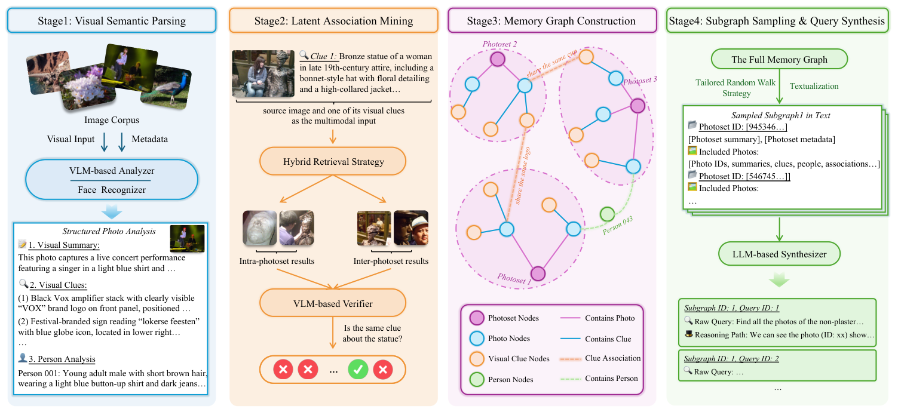</a> Original paper figure: Figure 3 · <a href="https://arxiv.org/pdf/2602.10809v2#page=5">Source: official PDF</a> Credit: Chenlong Deng et al.. © Paper authors/publisher. All rights remain with the original owner. |
| **ICML 2026** | Fix Before Search | Fix Before Search: Benchmarking Agentic Visual Query Pre-processing in Multimodal RAG | [Paper](https://proceedings.mlr.press/v306/zeng26w.html) · [Code](https://github.com/phycholosogy/VQQP_Bench) |  Original paper figure: Figure 1 · <a href="https://raw.githubusercontent.com/mlresearch/v306/main/assets/zeng26w/zeng26w.pdf#page=1">Source: official PDF</a> Credit: Shenglai Zeng et al.. © Paper authors/publisher. All rights remain with the original owner. |
| **ICLR 2026** | MC-Search | MC-Search: Evaluating and Enhancing Multimodal Agentic Search with Structured Long Reasoning Chains | [Paper](https://arxiv.org/abs/2603.00873) · [Code](https://mc-search-project.github.io/) | <a href="assets/frameworks/mc-search.png">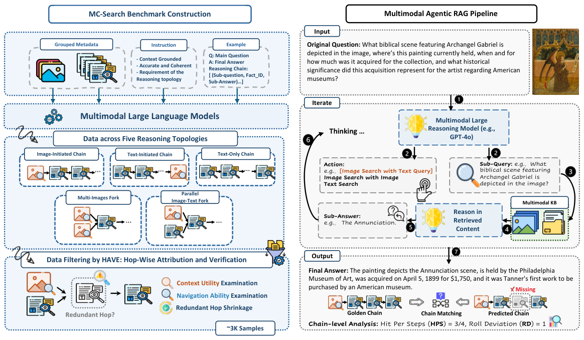</a> Original paper figure: Figure 2 · <a href="https://arxiv.org/pdf/2603.00873v1#page=3">Source: official PDF</a> Credit: Xuying Ning et al.. © Paper authors/publisher. All rights remain with the original owner. |
| **ICLR 2026** | MMSearch-Plus | MMSearch-Plus: Benchmarking Provenance-Aware Search for Multimodal Browsing Agents | [Paper](https://arxiv.org/abs/2508.21475) · [Code](https://github.com/mmsearch-plus/MMSearch-Plus) |  Original paper figure: Figure 1 · <a href="https://arxiv.org/pdf/2508.21475v3#page=2">Source: official PDF</a> Credit: Xijia Tao et al.. © Paper authors/publisher. All rights remain with the original owner. |
| **arXiv 2026** | Agentic Planning | Reason Before You Retrieve: Agentic Planning for Multi-modal RAG | [Paper](https://arxiv.org/abs/2607.22643) | <a href="assets/frameworks/reason-before-retrieve.png">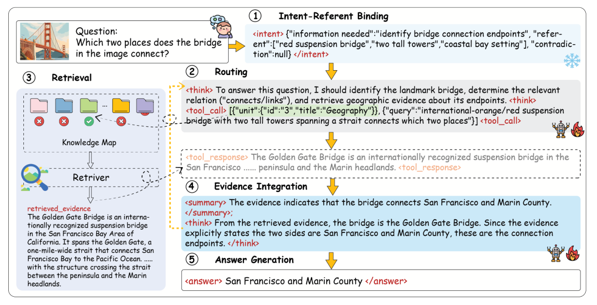</a> Original paper figure: Figure 1 · <a href="https://arxiv.org/pdf/2607.22643v1#page=2">Source: official PDF</a> Credit: Tianyu Yang et al.. © Paper authors/publisher. All rights remain with the original owner. |
| **arXiv 2026** | V-Retrver | V-Retrver: Evidence-Driven Agentic Reasoning for Universal Multimodal Retrieval | [Paper](https://arxiv.org/abs/2602.06034) · [Code](https://github.com/chendy25/V-Retrver) | <a href="assets/frameworks/v-retrver.png">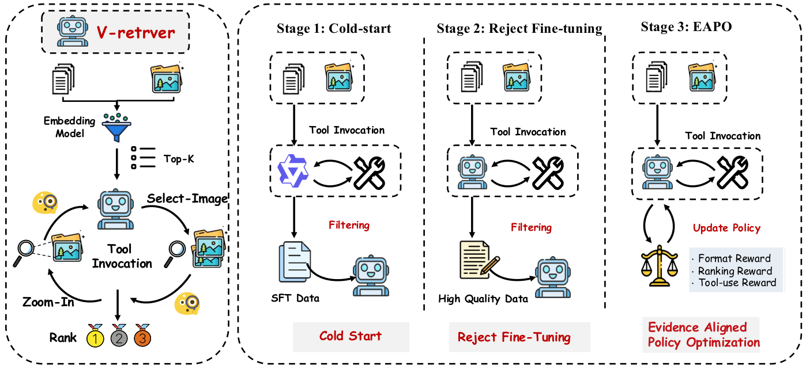</a> Original paper figure: Figure 2 · <a href="https://arxiv.org/pdf/2602.06034v4#page=4">Source: official PDF</a> Credit: Dongyang Chen et al.. © Paper authors/publisher. All rights remain with the original owner. |
| **arXiv 2026** | VLD-RAG | VLD-RAG: Agentic Vision-Language RAG for Long, Visually Rich Multi-Page Documents | [Paper](https://arxiv.org/abs/2607.24748) | <a href="assets/frameworks/vld-rag.png">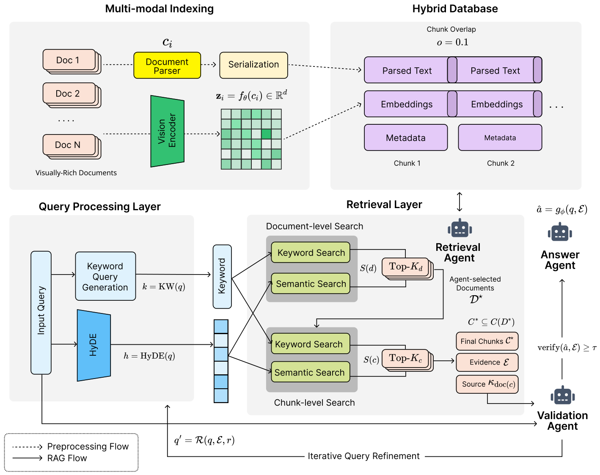</a> Original paper figure: Figure 1 · <a href="https://arxiv.org/pdf/2607.24748v1#page=2">Source: official PDF</a> Credit: Seonok Kim. © Paper authors/publisher. All rights remain with the original owner. |
| **arXiv 2026** | WeAgent-MMSearch | WeAgent-MMSearch: Native Text-Vision Interaction for Multimodal Search Agents | [Paper](https://arxiv.org/abs/2608.28062) | <a href="assets/frameworks/weagent-mmsearch.png">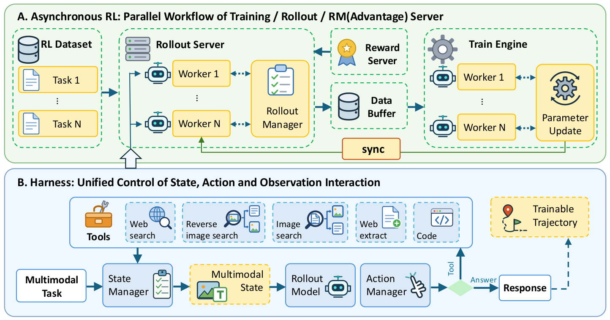</a> Original paper figure: Figure 3 · <a href="https://arxiv.org/pdf/2608.28062v2#page=5">Source: official PDF</a> Credit: Zongkai Liu et al.. © Paper authors/publisher. All rights remain with the original owner. |
| **MAGMaR at SIGIR 2025** | CollEX | CollEX: A Multimodal Agentic RAG System Enabling Interactive Exploration of Scientific Collections | [Paper](https://aclanthology.org/2025.magmar-1.2/) | <a href="assets/frameworks/collex.png">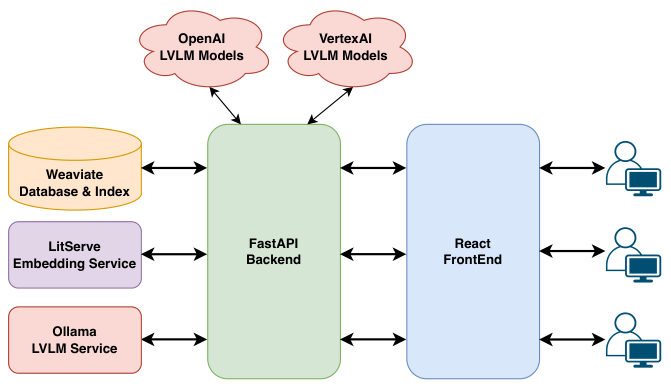</a> Original paper figure: Figure 4 · <a href="https://aclanthology.org/2025.magmar-1.2.pdf#page=3">Source: official PDF</a> Credit: Florian Schneider et al.. © Paper authors/publisher. All rights remain with the original owner. · <a href="https://creativecommons.org/licenses/by/4.0/">License</a> |
| **EMNLP 2025** | ViDoRAG | ViDoRAG: Visual Document Retrieval-Augmented Generation via Dynamic Iterative Reasoning Agents | [Paper](https://aclanthology.org/2025.emnlp-main.464/) · [Code](https://github.com/Alibaba-NLP/ViDoRAG) | <a href="assets/frameworks/vidorag.png">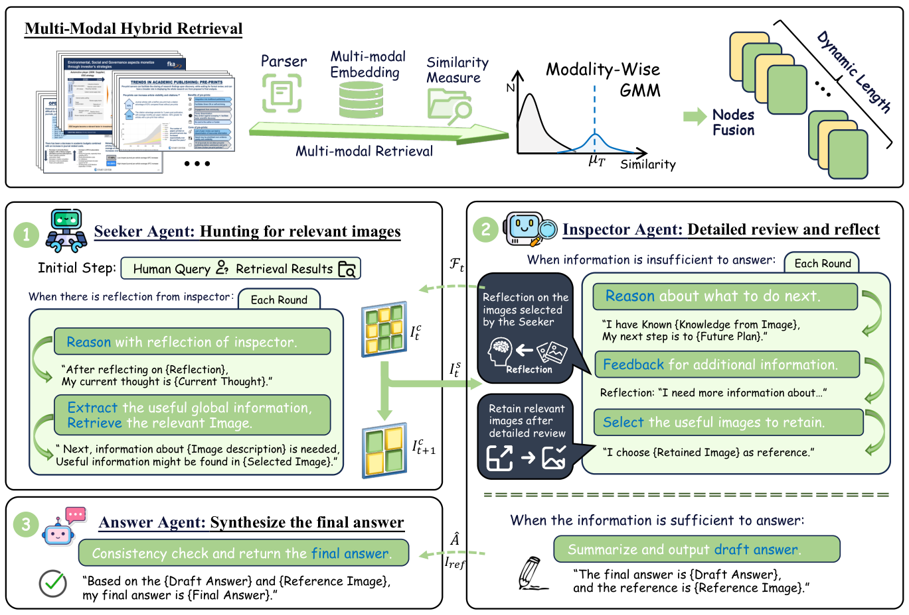</a> Original paper figure: Figure 3 · <a href="https://aclanthology.org/2025.emnlp-main.464.pdf#page=5">Source: official PDF</a> Credit: Qiuchen Wang et al.. © Paper authors/publisher. All rights remain with the original owner. · <a href="https://creativecommons.org/licenses/by/4.0/">License</a> |

## 图像处理与复原 Agent

| Conference / Journal | Method | Title | Resources | Framework |
| :--- | :--- | :--- | :--- | :---: |
| **CVPR 2026** | Dynamic Multi-Expert Fusion | Beyond Sequential Tools: A Unified VLM Agent System for Photographic Post-Processing via Dynamic Multi-Expert Fusion | [Paper](https://openaccess.thecvf.com/content/CVPR2026/papers/Xiong_Beyond_Sequential_Tools_A_Unified_VLM_Agent_System_for_Photographic_CVPR_2026_paper.pdf) | <a href="assets/frameworks/beyond-sequential-tools.png">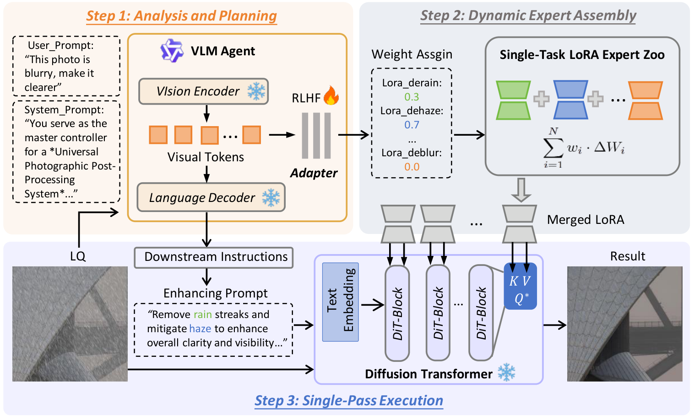</a> Original paper figure: Figure 1 · <a href="https://openaccess.thecvf.com/content/CVPR2026/papers/Xiong_Beyond_Sequential_Tools_A_Unified_VLM_Agent_System_for_Photographic_CVPR_2026_paper.pdf#page=3">Source: official PDF</a> Credit: Honglin Xiong et al.. © Paper authors/publisher. All rights remain with the original owner. |

## 生物医学视觉 Agent

| Conference / Journal | Method | Title | Resources | Framework |
| :--- | :--- | :--- | :--- | :---: |
| **CVPR 2026** | IBISAgent | IBISAgent: Reinforcing Pixel-Level Visual Reasoning in MLLMs for Universal Biomedical Object Referring and Segmentation | [Paper](https://openaccess.thecvf.com/content/CVPR2026/papers/Jiang_IBISAgent_Reinforcing_Pixel-Level_Visual_Reasoning_in_MLLMs_for_Universal_Biomedical_CVPR_2026_paper.pdf) · [Code](https://github.com/Yankai96/IBISAgent) | <a href="assets/frameworks/ibisagent.png">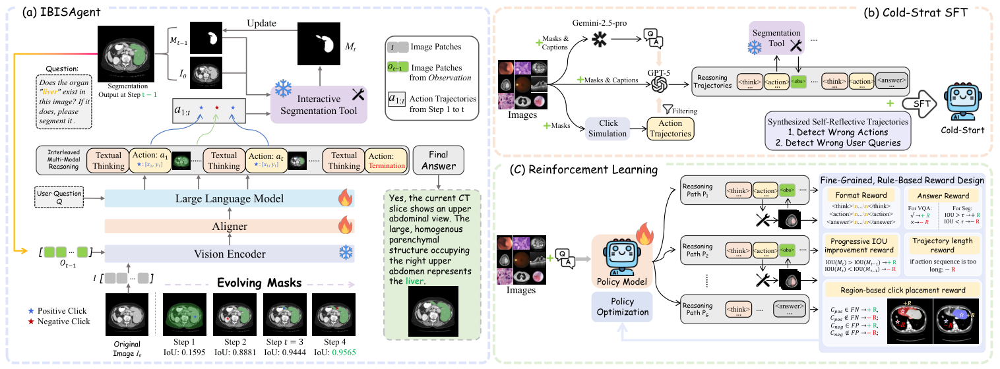</a> Original paper figure: Figure 2 · <a href="https://openaccess.thecvf.com/content/CVPR2026/papers/Jiang_IBISAgent_Reinforcing_Pixel-Level_Visual_Reasoning_in_MLLMs_for_Universal_Biomedical_CVPR_2026_paper.pdf#page=4">Source: official PDF</a> Credit: Yankai Jiang et al.. © Paper authors/publisher. All rights remain with the original owner. |

## 视频理解与多智能体系统

| Conference / Journal | Method | Title | Resources | Framework |
| :--- | :--- | :--- | :--- | :---: |
| **CVPR 2026** | Symphony | Symphony: A Cognitively-Inspired Multi-Agent System for Long-Video Understanding | [Paper](https://openaccess.thecvf.com/content/CVPR2026/papers/Yan_Symphony_A_Cognitively-Inspired_Multi-Agent_System_for_Long-Video_Understanding_CVPR_2026_paper.pdf) · [Code](https://github.com/Haiyang0226/Symphony) | <a href="assets/frameworks/symphony.png">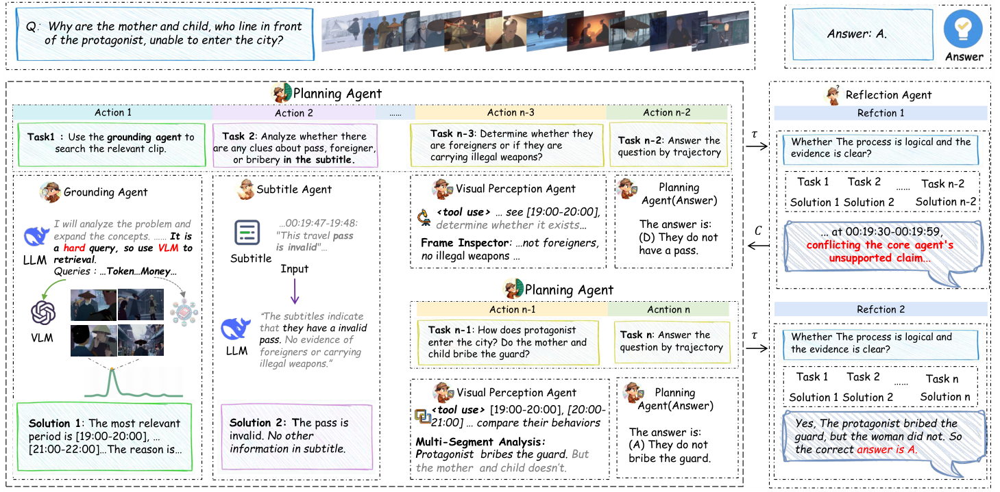</a> Original paper figure: Figure 2 · <a href="https://openaccess.thecvf.com/content/CVPR2026/papers/Yan_Symphony_A_Cognitively-Inspired_Multi-Agent_System_for_Long-Video_Understanding_CVPR_2026_paper.pdf#page=3">Source: official PDF</a> Credit: Haiyang Yan et al.. © Paper authors/publisher. All rights remain with the original owner. |

## 音频与工具集成推理

| Conference / Journal | Method | Title | Resources | Framework |
| :--- | :--- | :--- | :--- | :---: |
| **arXiv 2026** | ToolDF | TOOLDF: Tool-Integrated Reasoning for Mixed-Authenticity Audio Deepfake Detection | [Paper](https://arxiv.org/pdf/2609.03620v1) · [Code](https://github.com/rlataewoo/tooldf) | <a href="assets/frameworks/tooldf.png">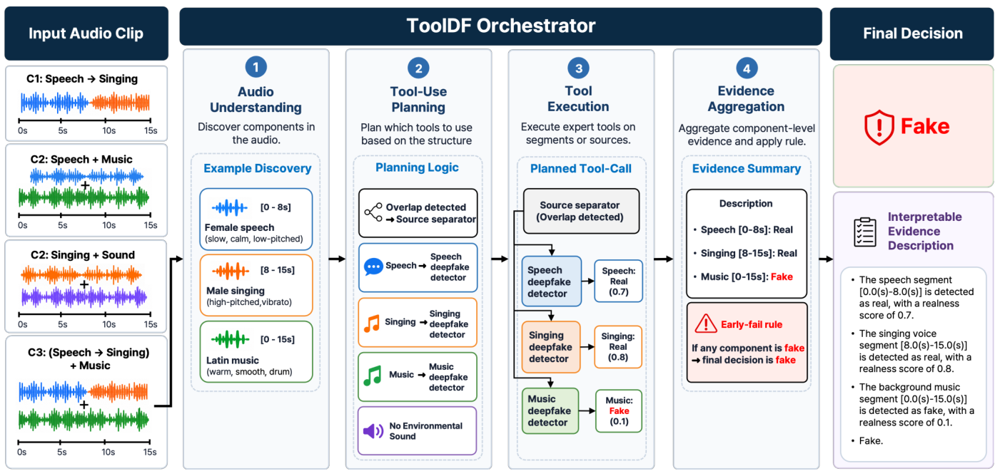</a> Original paper figure: Figure 1 · <a href="https://arxiv.org/pdf/2609.03620v1#page=3">Source: official PDF</a> Credit: Taewoo Kim et al.. © Paper authors/publisher. All rights remain with the original owner. |

## Contributing

See [CONTRIBUTING.md](CONTRIBUTING.md) for the review and reproducible cropping workflow. Add paper metadata to `data/papers.json`; keep original PDFs and previews in ignored `.figure-work/`.

Figure selection: end-to-end framework → architecture → pipeline → method overview. Surveys may use an original taxonomy or overview. Crop page whitespace only; preserve labels, legends, arrows, and subfigure markers.

## Acknowledgments and rights

Layout inspired by [Awesome Aerial-Ground Object Re-Identification](https://github.com/Reflection0427/Awesome-Aerial-Ground-Object-Re-Identification). Search-agent entries and reviewed figure metadata are shared with [Awesome Multimodal Agentic Retrieval](https://github.com/Reflection0427/Awesome-Multimodal-Agentic-Retrieval).

Repository code is MIT licensed. Paper figures remain under their original authors' or publishers' terms; the repository license does not relicense those figures. Rights holders may request removal or replacement with an official link via an Issue.
